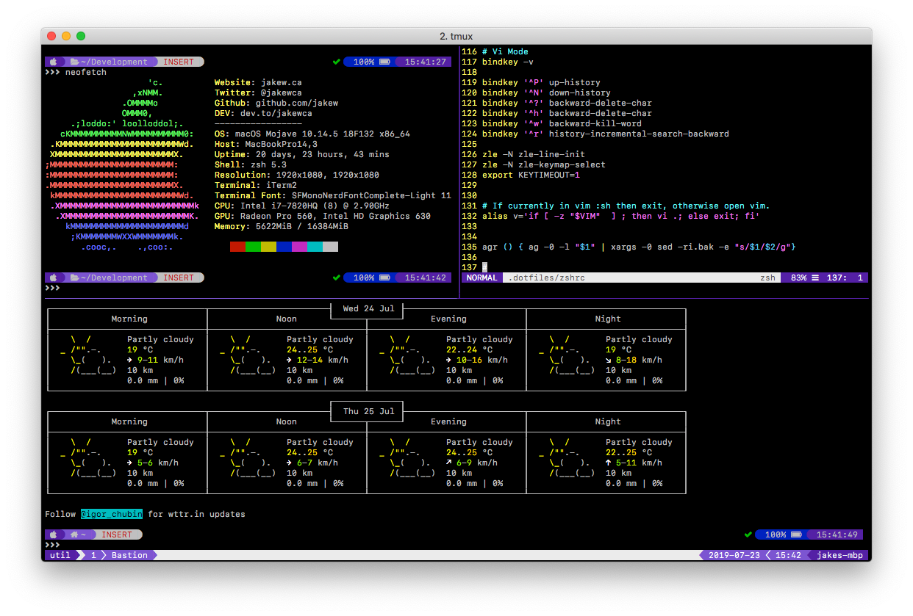

# dotfiles
This repository is used to track and maintain my current list of CLI applications and tools. 

### What's included?
* [ZSH](https://www.zsh.org),
* [Oh-My-ZSH](https://ohmyz.sh),
* [Powerlevel9k](https://p9k.org) as a theme (customized),
* [VIM](https://www.vim.org),
* [TMUX](https://github.com/tmux/tmux),
* [Tmuxinator](https://github.com/tmuxinator/tmuxinator),
* [The Silver Searcher](https://geoff.greer.fm/ag/)
* An assortment of config files for the above,
* A personalized [bash profile](blob/master/zshrc) for using them,
* Additional bash tidbits I find useful.


### Clone
To clone to a hidden `.dotfiles` directory in your root, use this command:

```
git clone git@github.com:jakew/dotfiles.git ~/.dotfiles
```

### Post Setup.sh
Run `./setup.sh`
Install TMUX plugins `prefix + I`

